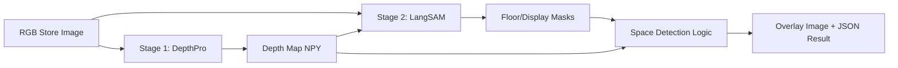

# Unmanned Store Space Recognition Model

> DepthPro?€ LangSAM???곌껐??RGB ?대?吏€?먯꽌 留ㅼ옣 怨듦컙???몄떇?섎뒗 2?④퀎 AI pipeline ?꾨줈?앺듃


## ?꾨줈?앺듃 媛쒖슂

Unmanned Store Space Recognition Model?€ ?⑥씪 RGB ?대?吏€瑜??낅젰?쇰줈 諛쏆븘 留ㅼ옣 ??吏꾩뿴 怨듦컙???몄떇?섎뒗 AI pipeline ?꾨줈?앺듃?낅땲?? DepthPro濡?depth map??留뚮뱾怨? LangSAM?쇰줈 ?먯뿰??prompt 湲곕컲 segmentation???섑뻾???? 吏꾩뿴?€?€ 鍮?怨듦컙??遺꾩꽍?섎뒗 ?먮쫫?쇰줈 援ъ꽦?섏뼱 ?덉뒿?덈떎.

?ы듃?대━?ㅼ뿉?쒕뒗 AI 紐⑤뜽 ?먯껜蹂대떎 DepthPro?€ LangSAM???섎굹???ы쁽 媛€?ν븳 pipeline?쇰줈 ?곌껐?섍퀬, Docker Compose濡??ㅽ뻾 ?섍꼍???뺣━???먯쓣 以묒떖?쇰줈 ?ㅻ챸?⑸땲??

## 臾몄젣 ?뺤쓽

臾댁씤 留ㅼ옣?먯꽌???곹뭹 蹂댁땐 ?쒖젏怨?吏꾩뿴 怨듦컙 ?곹깭瑜??뚯븙?섎뒗 ?쇱씠 以묒슂?⑸땲?? ?섏?留?蹂꾨룄 depth sensor瑜??ㅼ튂?섍굅??留ㅻ쾲 ?섎룞 labeling???섏〈?섎㈃ 鍮꾩슜怨??댁쁺 遺€?댁씠 而ㅼ쭛?덈떎.

???꾨줈?앺듃??RGB ?대?吏€ 湲곕컲?쇰줈 怨듦컙 ?뺣낫瑜?異붿젙?섍퀬, prompt 湲곕컲 segmentation??寃고빀??留ㅼ옣 吏꾩뿴 怨듦컙???몄떇?섎뒗 ?먮쫫??留뚮뱶????吏묒쨷?덉뒿?덈떎.

## ?닿껐 諛⑸쾿

- DepthPro瑜??ъ슜??RGB ?대?吏€?먯꽌 depth map???앹꽦?덉뒿?덈떎.
- LangSAM???ъ슜??floor, display rack, shelf ??怨듦컙 愿€???곸뿭??segmentation?덉뒿?덈떎.
- depth ?뺣낫?€ mask 寃곌낵瑜?寃고빀??怨듦컙 ?꾨낫瑜??뺣━?덉뒿?덈떎.
- `pipeline.sh`?€ `docker-compose.yml`濡?DepthPro stage?€ LangSAM stage瑜??쒖꽌?€濡??ㅽ뻾?섎룄濡?援ъ꽦?덉뒿?덈떎.
- GPU, checkpoint, ?낅젰/異쒕젰 寃쎈줈瑜??섍꼍 蹂€?섏? volume mount濡?愿€由ы뻽?듬땲??

## 二쇱슂 湲곕뒫

- RGB ?대?吏€ ?낅젰 泥섎━
- DepthPro 湲곕컲 depth map ?앹꽦
- LangSAM 湲곕컲 prompt segmentation
- floor/display ?곸뿭 遺꾨━
- mask clustering怨?depth 湲곕컲 怨듦컙 ?꾨낫 ?뺣━
- 寃곌낵 ?대?吏€?€ JSON output ?앹꽦
- Docker Compose 湲곕컲 2-stage pipeline ?ㅽ뻾

## 湲곗닠 ?ㅽ깮

| 援щ텇 | 湲곗닠 |
|---|---|
| Depth Estimation | Apple DepthPro |
| Segmentation | LangSAM, GroundingDINO, SAM2 |
| Runtime | Python, PyTorch, CUDA |
| Container | Docker, Docker Compose |
| Pipeline | shell script, environment variables, mounted volumes |

## Architecture



## ?닿? ?대떦????븷

- DepthPro?€ LangSAM???곌껐??怨듦컙 ?몄떇 AI pipeline 援ъ꽦
- Docker Compose 湲곕컲 stage 遺꾨━?€ ?ㅽ뻾 ?먮쫫 ?뺣━
- checkpoint, ?낅젰 ?대?吏€, output directory瑜??ы쁽 媛€?ν븳 援ъ“濡?愿€由?- segmentation mask?€ depth map??寃고빀?섎뒗 怨듦컙 ?몄떇 濡쒖쭅 ?뺣━
- GPU memory, 寃쎈줈, checkpoint 以€鍮?怨쇱젙?먯꽌 諛쒖깮?섎뒗 ?ㅽ뻾 臾몄젣 ?€??
## Demo Evidence

### ?낅젰 ?대?吏€


### 寃곌낵 ?대?吏€


## 臾몄젣 ?닿껐 怨쇱젙

### Depth sensor ?놁씠 怨듦컙 ?뺣낫 異붿젙

Depth sensor瑜?蹂꾨룄濡??먯? ?딄퀬 RGB ?대?吏€?먯꽌 depth ?뺣낫瑜??산린 ?꾪빐 DepthPro瑜??ъ슜?덉뒿?덈떎. ?대? ?듯빐 segmentation 寃곌낵??嫄곕━ ?뺣낫瑜??④퍡 ?쒖슜?????덈뒗 湲곕컲??留뚮뱾?덉뒿?덈떎.

### prompt 湲곕컲 segmentation

LangSAM???쒖슜??floor, shelf, display rack 媛숈? 怨듦컙 愿€??prompt瑜?湲곕컲?쇰줈 mask瑜??앹꽦?덉뒿?덈떎. ?⑥닚 媛앹껜 ?먯?蹂대떎 留ㅼ옣 援ъ“??留욌뒗 ?곸뿭 遺꾨━媛€ 以묒슂?덇린 ?뚮Ц??prompt?€ mask ?꾩쿂由??먮쫫???④퍡 ?ㅻ쨾?듬땲??

### pipeline ?ы쁽??
DepthPro?€ LangSAM?€ 媛곴컖 dependency?€ runtime 議곌굔???ㅻⅤ湲??뚮Ц???섎굹??script??紐⑤몢 ?욊린蹂대떎 Docker Compose stage濡?遺꾨━?덉뒿?덈떎. ?대? ?듯빐 ?낅젰 ?대?吏€, checkpoint, output 寃쎈줈瑜?紐낇솗???섎늻怨?pipeline ?ㅽ뻾 ?먮쫫???뺣━?덉뒿?덈떎.

## 肄붾뱶 援ъ“?먯꽌 ?뺤씤?????덈뒗 洹쇨굅

- `docker-compose.yml`: DepthPro stage?€ LangSAM stage orchestration
- `pipeline.sh`: ?낅젰/異쒕젰/checkpoint/image count 湲곕컲 ?ㅽ뻾 script
- `docker/Dockerfile.depthpro`: DepthPro ?ㅽ뻾 ?섍꼍
- `docker/Dockerfile.langsam`: LangSAM ?ㅽ뻾 ?섍꼍
- `lang-segment-anything/final_tool/space_detection.py`: 怨듦컙 ?몄떇 main logic
- `lang-segment-anything/final_tool/config.py`: pipeline path?€ environment ?ㅼ젙

## ?ㅽ뻾 諛⑸쾿

```bash
git clone https://github.com/protove/Unmanned-Store-Space-Recognition-Model.git
cd Unmanned-Store-Space-Recognition-Model
chmod +x pipeline.sh
./pipeline.sh
```

DepthPro checkpoint?€ ?낅젰 ?대?吏€ 以€鍮꾧? ?꾩슂?⑸땲??

## 愿€??留곹겕

- GitHub: https://github.com/protove/Unmanned-Store-Space-Recognition-Model

