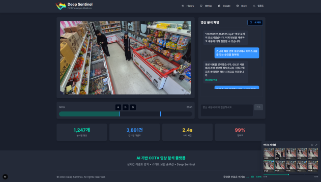
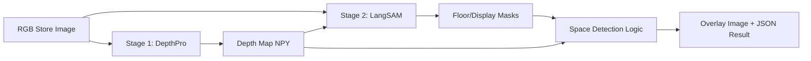
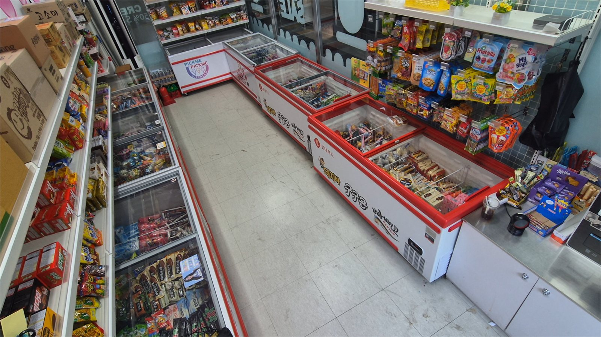
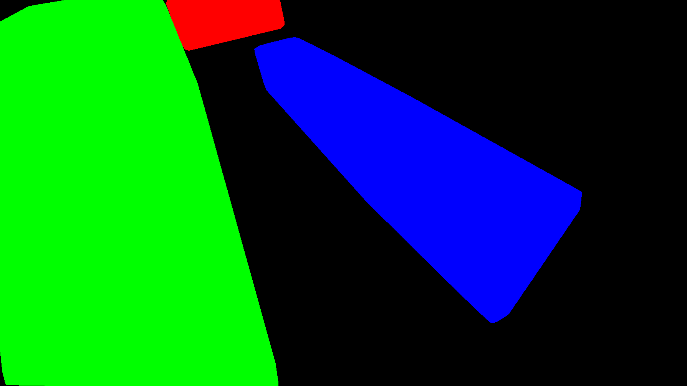

# Unmanned Store Space Recognition Model

> DepthPro와 LangSAM을 연결해 RGB 이미지에서 매장 공간을 인식하는 2단계 AI pipeline 프로젝트

<p align="center">
  
</p>

## 프로젝트 개요

Unmanned Store Space Recognition Model은 단일 RGB 이미지를 입력으로 받아 매장 내 진열 공간을 인식하는 AI pipeline 프로젝트입니다. DepthPro로 depth map을 만들고, LangSAM으로 자연어 prompt 기반 segmentation을 수행한 뒤, 진열대와 빈 공간을 분석하는 흐름으로 구성되어 있습니다.

포트폴리오에서는 AI 모델 자체보다 DepthPro와 LangSAM을 하나의 재현 가능한 pipeline으로 연결하고, Docker Compose로 실행 환경을 정리한 점을 중심으로 설명합니다.

## 문제 정의

무인 매장에서는 상품 보충 시점과 진열 공간 상태를 파악하는 일이 중요합니다. 하지만 별도 depth sensor를 설치하거나 매번 수동 labeling에 의존하면 비용과 운영 부담이 커집니다.

이 프로젝트는 RGB 이미지 기반으로 공간 정보를 추정하고, prompt 기반 segmentation을 결합해 매장 진열 공간을 인식하는 흐름을 만드는 데 집중했습니다.

## 해결 방법

- DepthPro를 사용해 RGB 이미지에서 depth map을 생성했습니다.
- LangSAM을 사용해 floor, display rack, shelf 등 공간 관련 영역을 segmentation했습니다.
- depth 정보와 mask 결과를 결합해 공간 후보를 정리했습니다.
- `pipeline.sh`와 `docker-compose.yml`로 DepthPro stage와 LangSAM stage를 순서대로 실행하도록 구성했습니다.
- GPU, checkpoint, 입력/출력 경로를 환경 변수와 volume mount로 관리했습니다.

## 주요 기능

- RGB 이미지 입력 처리
- DepthPro 기반 depth map 생성
- LangSAM 기반 prompt segmentation
- floor/display 영역 분리
- mask clustering과 depth 기반 공간 후보 정리
- 결과 이미지와 JSON output 생성
- Docker Compose 기반 2-stage pipeline 실행

## 기술 스택

| 구분 | 기술 |
|---|---|
| Depth Estimation | Apple DepthPro |
| Segmentation | LangSAM, GroundingDINO, SAM2 |
| Runtime | Python, PyTorch, CUDA |
| Container | Docker, Docker Compose |
| Pipeline | shell script, environment variables, mounted volumes |

## Architecture



## 내가 담당한 역할

- DepthPro와 LangSAM을 연결한 공간 인식 AI pipeline 구성
- Docker Compose 기반 stage 분리와 실행 흐름 정리
- checkpoint, 입력 이미지, output directory를 재현 가능한 구조로 관리
- segmentation mask와 depth map을 결합하는 공간 인식 로직 정리
- GPU memory, 경로, checkpoint 준비 과정에서 발생하는 실행 문제 대응

## Demo Evidence

### 입력 이미지

<p align="center">
  
</p>

### 결과 이미지

<p align="center">
  
</p>

## 문제 해결 과정

### Depth sensor 없이 공간 정보 추정

Depth sensor를 별도로 두지 않고 RGB 이미지에서 depth 정보를 얻기 위해 DepthPro를 사용했습니다. 이를 통해 segmentation 결과에 거리 정보를 함께 활용할 수 있는 기반을 만들었습니다.

### prompt 기반 segmentation

LangSAM을 활용해 floor, shelf, display rack 같은 공간 관련 prompt를 기반으로 mask를 생성했습니다. 단순 객체 탐지보다 매장 구조에 맞는 영역 분리가 중요했기 때문에 prompt와 mask 후처리 흐름을 함께 다뤘습니다.

### pipeline 재현성

DepthPro와 LangSAM은 각각 dependency와 runtime 조건이 다르기 때문에 하나의 script에 모두 섞기보다 Docker Compose stage로 분리했습니다. 이를 통해 입력 이미지, checkpoint, output 경로를 명확히 나누고 pipeline 실행 흐름을 정리했습니다.

## 코드 구조에서 확인할 수 있는 근거

- `docker-compose.yml`: DepthPro stage와 LangSAM stage orchestration
- `pipeline.sh`: 입력/출력/checkpoint/image count 기반 실행 script
- `docker/Dockerfile.depthpro`: DepthPro 실행 환경
- `docker/Dockerfile.langsam`: LangSAM 실행 환경
- `lang-segment-anything/final_tool/space_detection.py`: 공간 인식 main logic
- `lang-segment-anything/final_tool/config.py`: pipeline path와 environment 설정

## 실행 방법

```bash
git clone https://github.com/protove/Unmanned-Store-Space-Recognition-Model.git
cd Unmanned-Store-Space-Recognition-Model
chmod +x pipeline.sh
./pipeline.sh
```

실행 전에는 `data/input/`에 `test1.png`, `test2.png` 형식의 입력 이미지를 두고, `data/checkpoints/depth_pro.pt` 위치에 DepthPro checkpoint를 준비합니다. `pipeline.sh`는 checkpoint가 없을 때 DepthPro 모델 다운로드를 안내합니다.

LangSAM 단계에서는 SAM2와 GroundingDINO 계열 dependency가 사용됩니다. Docker 실행 시 `docker/Dockerfile.langsam`이 SAM2를 설치하고, HuggingFace/Torch 모델 파일은 `data/hf_cache`와 `data/torch_cache`에 캐시되도록 구성되어 있습니다. 첫 실행에서는 모델 다운로드와 GPU 초기화 때문에 시간이 걸릴 수 있습니다.

Docker를 사용하지 않고 직접 실행하는 경우에는 `README_SETUP.md`의 안내처럼 `install_sam2.sh`를 실행해 SAM2를 먼저 설치해야 합니다.

## 관련 링크

- GitHub: https://github.com/protove/Unmanned-Store-Space-Recognition-Model
